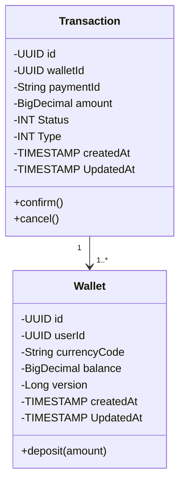

# Wallets Service
In Playtomic, we have a service to manage our wallets. Our players can top-up their wallets using a credit card and spend that money on our platform (bookings, racket rentals, ...)

That service has the following operations:
- You can query your balance.
- You can top-up your wallet. In this case, we charge the amount using a third-party payments platform (stripe, paypal, redsys).
- You can spend your balance on purchases in Playtomic. 
- You can return these purchases, and your money is refunded.
- You can check your history of transactions.

This exercise consists of building a proof of concept of that wallet service.
You have to code endpoints for these operations:
1. Get a wallet using its identifier.
1. Top-up money in that wallet using a credit card number. It has to charge that amount internally using a third-party platform.

You don't have to write the following operations, but we will discuss possible solutions during the interview:
1. How to spend money from the wallet.
1. How to refund that money.

## Getting Started

### Requirements

- OpenJDK 17
- Maven 3.9.6

### Running locally

1. Install dependencies with `make install`
2. Run the app with `make start`
3. Application should be accessible at <http://localhost:8090>
4. For development purposes as no endpoint is still created to create a wallet, for development profile a default `9f725ab9-77dc-4a0d-ae24-1b0e193ac97c` wallet is created

## Technical description

This is a Springboot application that servers as an API to be able to consult wallet and perform actions to it.

Actually we have 2 entities in this project with the following implementation:

### Concurrency

This project implements Optimistic Concurrency Control (OCC) to manage concurrent transactions and ensure data integrity without locking resources. OCC is based on the principle that multiple transactions can frequently complete without interfering with each other.
By using OCC, this project minimizes lock contention and improves performance, providing an efficient and scalable solution for managing concurrent data access.

